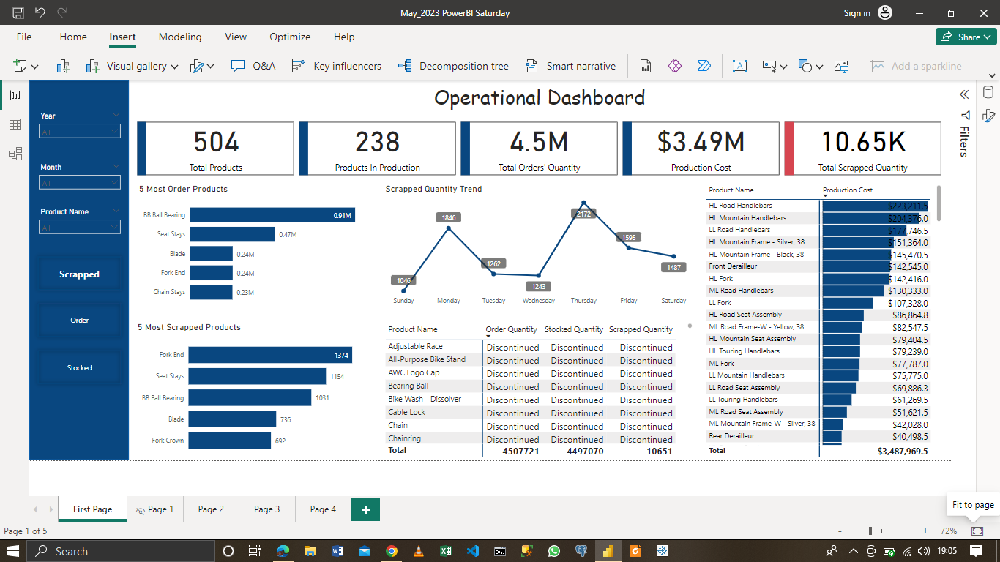

# Operational Dashboard
### Power BI Saturday
This is a learning dataset from Fabric community Nigeria

# Introduction

This project is a challenge organized by Power BI Saturday/Fabric Community Nigeria. It involves a production dataset that is different from other production datasets I have worked on.

# Concepts Applied

Here are some Power BI concepts that I was able to apply to this project:

1. Data Modeling
2. DAX Calculated Table (Calendar Table)
3. DAX Measures

# Source

The datasets were obtained from the AdventureWorks19 database. Its .bak file was downloaded, and the database was added to MS SQL Server. I used the Power BI SQL Server connector to connect to the database and queried the required tables. The tables needed for this challenge are production.products, production.BillOfMaterial, production.WorkOrder, and production.WorkOrderRouting.

| Step 1 | Step 2 
| -------------------------- | --- 
| .png) | .png) 

| Step 3 | Step 4
| --- | --- 
| .png) | .png)

# Data Cleaning

The dataset did not require any cleaning.

#### In the Data View, the following calculated table and columns were created:

1. Calendar DAX Table was created using
   
Calendar = CALENDARAUTO(12)

2. Production Timeline Calculated Column was created using

Production Timeline = DATEDIFF('Production WorkOrderRouting'[ActualStartDate].[Date], 'Production WorkOrderRouting'[ActualEndDate].[Date], DAY)

# Data Modeling

Power BI automatically generated a star schema model. I cross-checked and corrected the relationships when necessary. The relationship is shown below:

# Report View

This project includes one dashboard titled "Operational Dashboard." The dashboard has three slicers that filter the year, month, and product names. To interact with the dashboard, click [here](https://app.powerbi.com/links/DNHFFGXXnY?ctid=747f2c6a-f963-4814-84fd-6ef1ee9e87bf&pbi_source=linkShare&bookmarkGuid=a19d222a-5f08-46fd-9da2-6c6254f7209a)!

# Operational Dashboard

## Insight Uncovered

- A total of 4,507,721 products were ordered and produced. The highest produced product was BB Ball Bearing, accounting for 43.67% of the total quantity (912K units).

- A total of 10,651 products were scrapped due to various reasons, with Fork End products being the most commonly scrapped (27.55% of the total).

- The cost of production amounted to $3.49 million.

- The company has a total of 504 product lines, out of which 238 are currently in production, indicating that 266 product lines have been discontinued. From 2011 to 2014, the company completed a total of 72,591 manufacturing cycles, with the highest number of cycles recorded in 2013.

- Out of the 4,507,721 products ordered and produced, 10,651 were scrapped, resulting in a total of 4,497,070 products in stock. Analysis of order trends over time revealed that the year 2011 had the fewest orders due to the first order being placed in June. However, 2013 had the highest number of ordered products. When examining monthly order trends, it was observed that orders remained relatively stable with occasional peaks and lows. The most frequently ordered product was BB Ball Bearing, with a quantity of 0.91 million units.

- Scrapped products analysis indicated that 10,651 items were scrapped, with Fork End being the most frequently scrapped product. In terms of yearly trends, 2013 had the highest number of scrapped products, totaling 5.5 thousand. Further examination of monthly and daily trends revealed that months with higher order volumes also had an increased number of scrapped products.

- Records indicate that the actual cost of production matched the planned production cost, indicating that no additional production costs were incurred.
